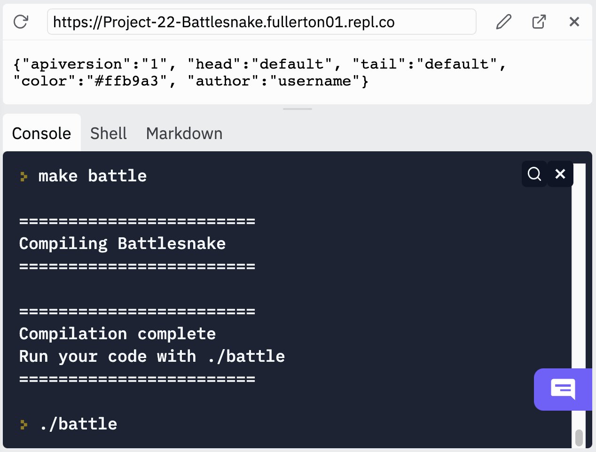

# Project 2.2: Battlesnake

In this project, you will learn how to:
* write helper functions
* write AI algorithms

## File structure

* `Makefile` - Configuration for `make`.
* `battlesnake.cpp` - Your code goes here.
* `battlesnake_test.cpp` - Your tests go here.
* `battlesnake.h` - Header file for `battlesnake.cpp`.
* `LICENSE` - Legal boilerplate stuff.
* `googletest/` - Contains code for the GoogleTest framework.
* `lib/` - Contains library files you may reference.
    * `snake_main.cpp` - Contains main function which runs the snake game.
    * `snake_logic.cpp` - Contains functions that implement the game logic.
    * `snake_logic.h` - Header file for `snake_logic.cpp`.
    * `snake.h` - Contains enum & struct definitions relevant to the snake game.
    * `snake_presets.o` - Contains compiled logic for preset bots.
    * `snake_presets.h` - Header file for `snake_presets.o`.
    * `battlesnake_main.cpp` - Contains another main function that allows your bot to compete on [battlesnake.com](https://play.battlesnake.com/).
    * `httplib.h` - Networking magic.
    * `json.hpp` - Networking magic.

**Do not change any files other than `battlesnake.cpp`, `battlesnake.h` and `battlesnake_test.cpp`!**

## Make commands

You have the same `make` commands as usual (format, test, build, all, clean). You also have `make battle`  which we'll get to in a later section (see Online play).

## The Battlesnake game

The game will be similar to how it was in Project 2 Part 1, except there can be multiple snakes playing at the same time. Here are the modified rules:

1. Human or bot-controlled snakes move on a 2D board.
1. At the beginning, each snake is 3 cases long (but squished into 1 case).
1. Each snake starts at a random valid position. Each turn, they can either move up, down, left or right.
1. Each snake starts with 100 health and loses 1 health per turn.
1. Food will spawn randomly on the board. Snakes grow by 1 and reset their health to 100 by eating food.
1. Snakes die if they go out of bounds.
1. Snakes die if their head collides with a snake (that includes their own body).
1. The goal for each snake is to survive as long as possible.

Example screenshot:
```
######################
#            OO0     #
#                    #
#                    #
#  O                 #
#  O@                #
#                    #
#                    #
#        +  0OOO   + #
#                    #
#                    #
######################
Snake - WASD (C)ontinue (R)estart (Q)uit - Turn: 4
Alive: 3
ID: player - HP: 96 - Length: 3
ID: hungrybot0 - HP: 97 - Length: 4
ID: circlebot1 - HP: 96 - Length: 3
```
The head of a human-controlled snake is represented by a `@`, whereas the head of a bot-controlled snake is represented by a `0`. Everything else remains the same.

The game has already been implemented for you. You can try it out by running `make build` then `./snake`. Your goal is to write the logic for a custom snake bot. The game will call your `bot_move()` function in `battlesnake.cpp` whenever a `CUSTOM` snake needs to make a move. The caller will give you necessary information about the current game (eg. positions of all snakes and food), then you should use that to decide on a move for the `CUSTOM` snake(s).

Here's an example containing a `CUSTOM` snake:

```
$ ./snake
Play Snake in real time? (1/0)
0
How many turns between food spawns? (5-24)
5
Number of humans? (1/0)
0
Number of bots? (0-4)
1
Select logic for bot0:
    0 - CUSTOM (Your own bot)
    1 - HUNGRY (Likes to eat)
    2 - CIRCLE (Circles around)
    3 - GREEDY (Follows pattern)
    4 - RANDOM (Unpredictable)
    5 - HEALTH (Eats periodically)
0
```

If you play this out, you'll notice that the snake will run straight up into the walls and die. That's because `bot_move()` currently returns `UP` regardless of the game state.

### Data structures

Here are the data structures defined in `battlesnake.h` that should help you choose a move more wisely.

#### GameState

```c++
struct GameState {
  std::string id;
  int turn;
  int height;
  int width;
  std::vector<Pos> food;
  std::vector<BattleSnake> snakes;
};
```

Let's say we have a variable `GameState gs` like the one in the input arguments to `bot_move()`. Here are the relevant information you can extract from it:

* `gs.id`: ID of the current game. When you run `./snake`, this will be set to `"local"`.
* `gs.turn`: How many turns the current game has been going for. A new game starts at turn 0.
* `gs.height`: The height of the board (excluding walls). This should be set to `10` when running locally.
* `gs.width`: The width of the board (excluding walls). This should be set to `20` when running locally.
* `gs.food`: List of positions on the board that contain food. 
* `gs.snakes`: List of snakes in the current game, dead or alive.

**Note**: Refer to Project 2 part 1 for information about custom types `Pos` and `Move`.

#### BattleSnake

```c++
struct BattleSnake {
  std::string id;
  int health;
  int length;
  std::vector<Pos> body;
  Pos head;
};
```

Each snake in the game will be represented by a `BattleSnake` struct. Let's say we have a variable `BattleSnake s` like the one in the input arguments to `bot_move()`. Here are the relevant information you can extract from it:

* `s.id`: ID of the snake. When running locally, the human-controlled snake will have ID `player`. A `CUSTOM` snake might have ID `custombot0`.
* `s.health`: How much health the snake has left. If it's 0 or less, the snake is dead.
* `s.length`: Current length of the snake. Remember that each snake starts off with length 3 and grows as they eat more food.
* `s.body`: List of positions held by the snake (including its head). Its size should be equal to `s.length`.
* `s.head`: Position of the snake head. This should be equal to `s.body[0]`. It's available for your convenience.

### `bot_move()`

```c++
Move bot_move(const GameState& gs, const BattleSnake& you);
```

**TODO**: Implement this function.

Your goal for Project 2 part 2, as stated above, is to implement this function which will be called whenever a `CUSTOM` snake needs to make a move. The `you` variable will represent whichever `CUSTOM` snake is making the move, and `gs` will contain the game state.

This may sound like a daunting task, but we can break it down into smaller pieces using helper functions. In pseudocode, here's how we can get started:

```
For each possible move (UP, LEFT, DOWN, RIGHT):
  1. Calculate the position we'd end up at if we took that move.
  2. Check if we'd be out of bounds. If yes, skip.
  3. If no, choose this move.
If we end up here, it's probably game over so let's go UP and hope for the best.
```

In C++, this could look like:

```c++
vector<Move> possible_moves = {UP, LEFT, DOWN, RIGHT};
for (Move move : possible_moves) {
  Pos position = new_position(you.head, move);
  if (!out_of_bounds(gs, position)) {
    return move;
  }
}
return UP;
```

Notice that the code above assumes we have the following two helper functions:

```c++
Pos new_position(const Pos& current, Move move);
bool out_of_bounds(const GameState& gs, const Pos& position);
```

These have been declared for you in `battlesnake.h` and tested in `battlesnake_test.cpp`. Furthermore, `new_position()` has been implemented for you in `battlesnake.cpp`.

**TODO**:

1. Implement `out_of_bounds()` to return whether the given position is out of bounds.
    * You should use `gs.width` and `gs.height`!
    * Intersecting with walls counts as being out of bounds.
1. Make sure your code is correct by running `make test` and asserting that `TEST(BattlesnakeTest, OutOfBounds)` runs OK.
1. Put the above code snippet into your function body for `bot_move()`.

If you followed these steps correctly, you'll get a `CUSTOM` snake who can avoid walls! However, it'll still die out of the blue because it doesn't know how to avoid itself...

The next step would be to implement a function that tells us if a given position would collide with a snake.

```c++
bool collide_snake(const GameState& gs, const Pos& position);
```

**TODO**:

1. Declare the function above in `battlesnake.h`.
    * You can refer to how `new_position()` and `out_of_bounds` were declared.
1. Write out unit tests for it in `battlesnake_test.cpp`.
    * For example, you can name it `TEST(BattlesnakeTest, CollideSnake)`.
    * You should use `EXPECT_TRUE`, `EXPECT_FALSE` and/or `EXPECT_EQ`.
1. Implement it in `battlesnake.cpp`.
    * PS: You don't need to worry about collision when the other snake is dead! (hp <= 0)
    * PS: Self collision will be taken care of if you loop through `gs.snakes`.
1. Make sure your code is correct by running `make test` and asserting that the test your wrote runs OK.
1. Call the function you just implemented wherever appropriate in `bot_move()`.

If you followed these steps correctly, your `CUSTOM` snake will behave similar to the preset `GREEDY` snake.

**TODO**: Follow these steps again for all helper functions you wish to add.

### Preset snakes

Below are the preset snakes that you can play with. A pseudocode version of their bot logic has been provided for your inspiration.

#### Greedy snake

```
For each possible move (UP, DOWN, LEFT, RIGHT):
  1. Calculate the position we'd end up at if we took that move.
  2. Check if we'd be out of bounds or colliding with a snake. If yes, skip.
  3. If no, choose this move.
If we end up here, go UP.
```

#### Random snake

```
For each possible move (UP, DOWN, LEFT, RIGHT):
  1. Calculate the position we'd end up at if we took that move.
  2. Check if we'd be out of bounds or colliding with a snake. If yes, skip.
  3. If no, add it to a list of eligible moves.
If the list of eligible moves is empty, go UP.
Otherwise, pick a random eligible move.
```

#### Circle snake

```
For each possible move (UP, DOWN, LEFT, RIGHT):
  1. Calculate the position we'd end up at if we took that move.
  2. Check if we'd be out of bounds or colliding with a snake. If yes, skip.
  3. If no, add it to a list of eligible moves.
If the list of eligible moves is empty, go UP.
Based on the snake body, calculate the last move taken (might need helper function).
If the last move is among the eligible moves, continue picking that one (this causes circling).
Otherwise, pick a random eligible move.
```

#### Hungry snake

```
For each possible move (UP, DOWN, LEFT, RIGHT):
  1. Calculate the position we'd end up at if we took that move.
  2. Check if we'd be out of bounds or colliding with a snake. If yes, skip.
  3. If no, add it to a list of eligible moves.
If the list of eligible moves is empty, go UP.
For each eligible move:
  Calculate the distance towards the closest food, if any (might need helper function).
Pick the move that minimizes the distance towards the closest food.
```

#### Health snake

```
If health is above 50, behave like the Circle snake.
Otherwise, behave like the Hungry snake.
```

### Benchmarks

Your `CUSTOM` snake will be put in the following situations:

- **Solo**: just itself (200x)
- **Duo**: with 1 preset snake (1000x)
- **Multi**: with 5 of the same preset snakes (1000x)
- **All**: with 1 of each preset snake (200x)

In each simulation, we will evaluate:

- **Turns**: how long you survived, up to 1000 turns
- **Length**: length at death or at the 1000th turn
- **Win**: whether you were the sole survivor at the end

Each of the 12 metrics below is worth 5 points for a total of 60 points.

- Eg. you survive on average 120 turns in duo situations -> you get 4 points (120 / 150).
- Eg. you win 80 times out of 200 in multi situations -> you get 5 points (80 >= 25)

| Targets | Turns | Length | Wins |
| --- | --- | --- | --- |
| Solo | 200 | 15 | 200 |
| Duo | 150 | 10 | 75 |
| Multi | 100 | 5 | 25 |
| All | 100 | 5 | 25 |

### Online play

This section is optional, but you can bring your bot online to compete with other bots and attempt various challenges if you follow the steps below:

1. Create an account on [battlesnake.com](https://play.battlesnake.com/).
1. Put your username as the `USERNAME` constant in `battlesnake.cpp`.
1. Feel free to change your snake's appearance by modifying `SNAKE_HEAD`, `SNAKE_TAIL` and `SNAKE_COLOR` based on this [guide](https://docs.battlesnake.com/references/personalization).
1. Run `make battle`.
1. Run `./battle`. You should see an URL pop up in your Replit workspace.
1. Go to your profile on [battlesnake.com](https://play.battlesnake.com/) then click on `CREATE NEW BATTLESNAKE`.
1. Give your snake a name and paste in the URL, then hit `SAVE`.
1. Now you can do `Challenges` or `PLAY GAME` with your bot.
    * Note: you'll need to keep your Replit workspace open.

Example screenshot:



## Rubric

* (75 points) Programming
  * (1.5 points) TODO comment check
  * (1.5 points) Style check
  * (2 points) Names inscribed
  * (60 points) Autograder test case (see Benchmarks)
  * (10 points) Good code design

## Due Date

- Section A: December 7, 11:59pm
- Section B: December 9, 11:59pm

See [bit.ly/hwei-cs120-info](https://bit.ly/hwei-cs120-info) for all due dates.